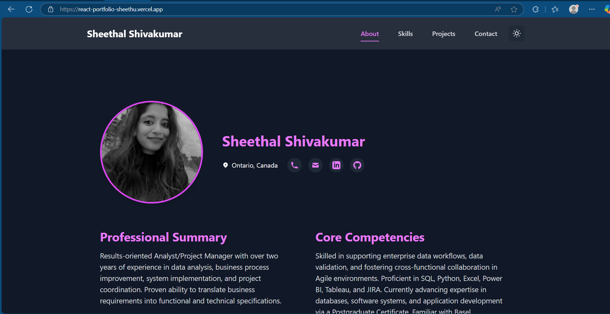
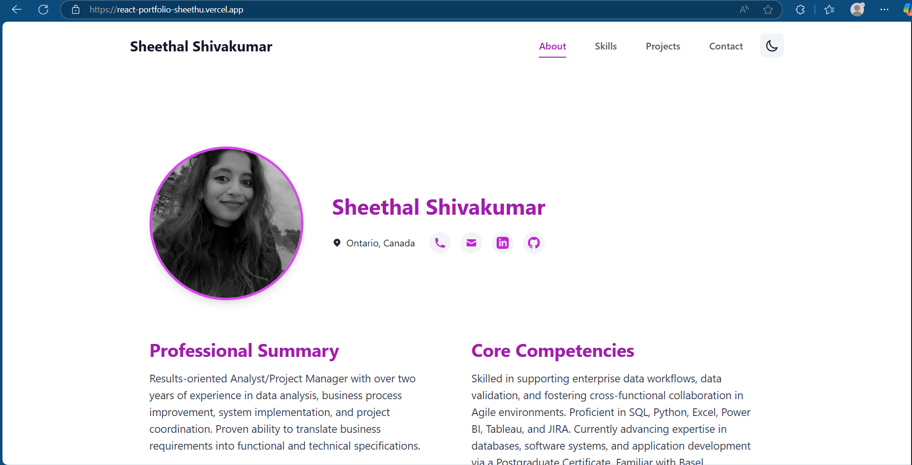

# 🌟 Sheethal Shivakumar - Portfolio

Welcome to my personal portfolio! This website showcases my skills, projects, and professional journey.

## 🔗 Live Site

[Visit My Portfolio](https://react-portfolio-sheethu.vercel.app)

## 📸 Site Preview




## ✨ Features Implemented

1. **Interactive Navigation**
   - Smooth scrolling navigation
   - Responsive hamburger menu for mobile
   - Fixed header with blur effect
   - Active section highlighting

2. **Dynamic Content Display**
   - Expandable skill categories with preview
   - Collapsible job descriptions
   - Interactive project cards with live demos
   - Icon-based contact system with tooltips

3. **Visual Enhancements**
   - Dark/Light mode toggle
   - Smooth transitions and animations
   - Hover effects on interactive elements
   - Professional styling with Tailwind CSS

4. **User Experience**
   - Mobile-first responsive design
   - Fast page load times
   - Intuitive navigation
   - Professional resume download
   - Social media integration

5. **Technical Features**
   - React 18 with Vite for fast development
   - Context API for state management
   - Component-based architecture
   - Optimized asset loading
   - Git version control

## 🎯 About Me

Results-oriented Analyst/Project Manager with over two years of experience in data analysis, business process improvement, and project coordination. Currently advancing expertise in software development and databases through a Postgraduate Certificate program.

## 💻 Technical Skills

- **Programming Languages**: SQL, Python, JavaScript, React
- **Data Analysis**: Excel, Power BI, Tableau
- **Project Management**: JIRA, Agile methodologies
- **Databases**: MySQL, PostgreSQL
- **Tools & Technologies**: Git, GitHub, VS Code

## 🛠️ Portfolio Features

- **Responsive Design**: Mobile-first approach with seamless display across all devices
- **Dark/Light Mode**: Theme toggle with system preference detection
- **Modern UI Components**:
  - Fixed header with backdrop blur
  - Animated hamburger menu
  - Smooth scroll navigation
  - Interactive project cards
  - Expandable skill categories with previews
  - Icon-based contact system with hover tooltips
  - Animated section transitions
  - Professional resume download button

## 🎨 UI/UX Features

- **Animations & Transitions**:
  - Smooth section transitions
  - Hover effects on interactive elements
  - Loading animations
  - Expandable content sections
- **Accessibility**:
  - ARIA labels for all interactive elements
  - Keyboard navigation support
  - High contrast color schemes
  - Screen reader friendly structure
- **Performance**:
  - Optimized image loading
  - Lazy-loaded components
  - Efficient state management
  - Fast page transitions

## 🚀 Built With

- **Frontend**: React 18, Vite
- **Styling**: Tailwind CSS
- **State Management**: React Context
- **Deployment**: Vercel
- **Version Control**: Git & GitHub

## 🔨 Challenges & Solutions

1. **Responsive Design Implementation**
   - **Challenge**: Creating a consistent layout across different screen sizes
   - **Solution**: Implemented mobile-first approach with Tailwind CSS breakpoints and flexible grid systems

2. **Performance Optimization**
   - **Challenge**: Initial load time was slow due to large images and animations
   - **Solution**: 
     - Implemented lazy loading for images
     - Optimized asset sizes
     - Used efficient state management
     - Implemented code splitting

3. **State Management**
   - **Challenge**: Managing theme preferences and component states across the application
   - **Solution**: Implemented Context API for global state management and local storage for user preferences

4. **Animation Performance**
   - **Challenge**: Animations were causing performance issues on mobile devices
   - **Solution**: 
     - Optimized animations using CSS transforms
     - Implemented throttling for scroll events
     - Used hardware-accelerated properties

5. **Cross-Browser Compatibility**
   - **Challenge**: Inconsistent behavior across different browsers
   - **Solution**: 
     - Implemented CSS prefixes
     - Used feature detection
     - Added fallback styles

## 📱 Contact

- **Email**: shivakumarsheethal@gmail.com
- **LinkedIn**: [Sheethal Shivakumar](https://www.linkedin.com/in/sheethal-shivakumar/)
- **GitHub**: [sheethal5shivakumar](https://github.com/sheethal5shivakumar)
- **Location**: Ontario, Canada

## 🔧 Local Development

1. Clone the repository:
   ```bash
   git clone https://github.com/sheethal5shivakumar/React-Portfolio--Sheethu.git
   ```

2. Install dependencies:
   ```bash
   cd React-Portfolio--Sheethu
   npm install
   ```

3. Start development server:
   ```bash
   npm run dev
   ```

4. Build for production:
   ```bash
   npm run build
   ```

## 🔄 Latest Updates

- Added expandable skill categories with preview functionality
- Implemented icon-based contact system with hover tooltips
- Enhanced accessibility with ARIA labels and keyboard navigation
- Improved mobile responsiveness and touch interactions
- Added smooth animations for better user experience
- Integrated professional resume download feature

## 📝 License

MIT © Sheethal Shivakumar
